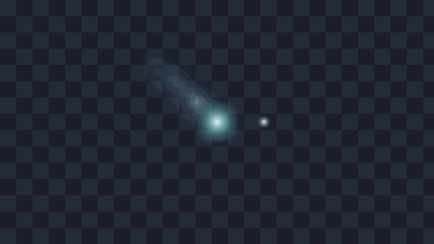
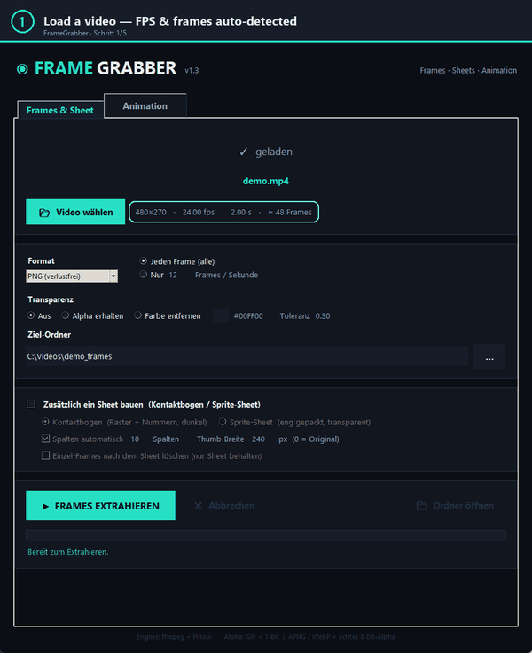
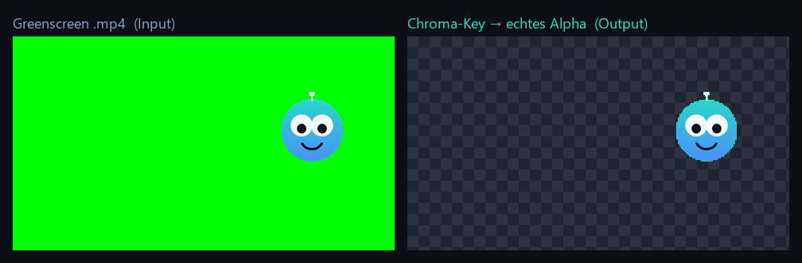
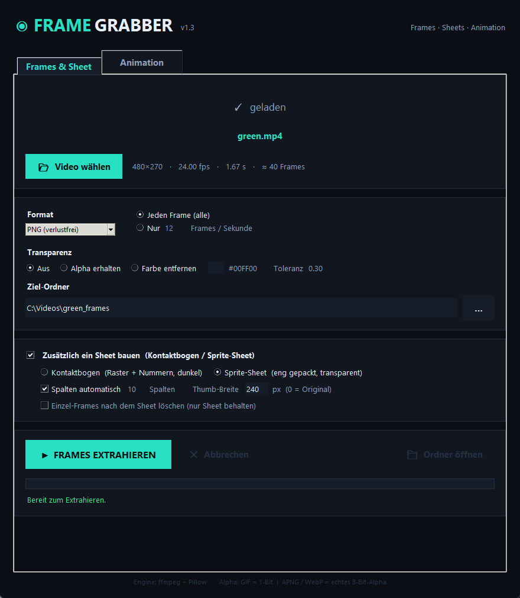
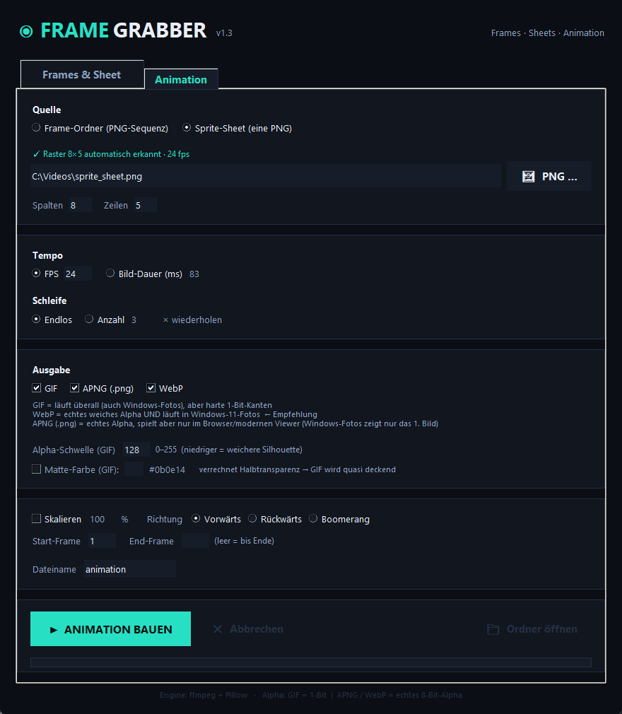
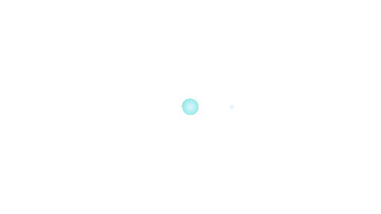
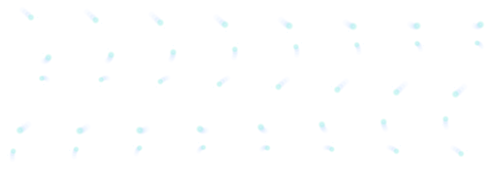
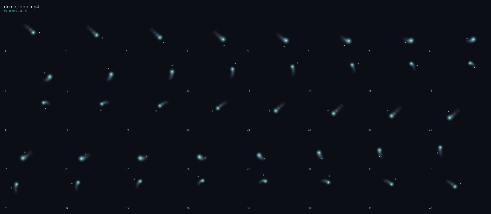

<div align="center">

# 🎬 FrameGrabber

### Extract every frame of a clip — and build clean, **alpha‑transparent animations** (GIF · APNG · WebP).
### Mach aus jedem Clip Einzelbilder — und saubere, **alpha‑transparente Animationen** (GIF · APNG · WebP).




### 🇬🇧 [English](#-english)  ·  🇩🇪 [Deutsch](#-deutsch)

</div>

---

<a name="-english"></a>
## 🇬🇧 English

**An offline desktop tool that turns any clip into individual frames — and into finished, alpha‑transparent animations. You own a green‑screen `.mp4`? Get a clean transparent GIF / WebP out of it. Free. No cloud. No watermark.**

### 🎥 See it in action



### 💥 The one‑click WOW

> Green‑screen `.mp4` → clean cut‑out with **real alpha** (chroma‑key).



### 🖥️ Two tabs

| Tab 1 — Frames & Sheet | Tab 2 — Animation |
|:--:|:--:|
|  |  |
| Extract **every frame** + build contact / sprite sheets | Frames or sprite sheet → **GIF / APNG / WebP** |

### 🎨 What it makes

| Transparent loop | Transparency proof (checkerboard) |
|:--:|:--:|
|  |  |
| **Sprite sheet** (tight, transparent) | **Contact sheet** (numbered preview) |
|  |  |

### ✨ Features

**Tab 1 — Frames & Sheet**
- 🎞️ **Extract every single frame** of a clip, losslessly (`fps_mode passthrough`, nothing dropped) — or only *N frames/second*.
- 🖼️ Output as **PNG** (lossless) · JPG · WebP · BMP · TIFF.
- 🪄 **Transparency** — **keep** existing alpha (APNG / transparent MOV / WebM) **or** **chroma‑key** a background colour (green screen) into real alpha, with a colour picker + tolerance.
- 🧩 **Sheets** from all frames — a numbered **contact sheet** and a tightly‑packed transparent **sprite sheet**.

**Tab 2 — Animation**
- 🔁 Turn a **frame folder** *or* a **sprite sheet** into a looping animation.
- 🟢 **GIF** (plays everywhere, 1‑bit transparency) · 🟣 **APNG** & 🔵 **WebP** (**true 8‑bit soft alpha**).
- 🎛️ FPS / frame‑delay · infinite or N loops · alpha threshold · matte colour · scale · forward / reverse / **boomerang** · start‑end trim.
- 🧠 **Auto‑detect**: a sprite sheet's columns/rows **and** the source FPS are read automatically → it plays at the **original speed**, no manual setup.

### 🧱 Perfect registration, for free
Every frame is the full canvas, so all frames already line up pixel‑perfect — no jitter, no alignment step. Sprite sheets are sliced exactly on the grid (verified byte‑identical round‑trip).

### 🚀 Install
```bash
# Requirements: Python 3.11+, ffmpeg on PATH, Pillow
pip install pillow
pip install tkinterdnd2   # optional: drag & drop into the window
```
ffmpeg: from https://ffmpeg.org or `choco install ffmpeg`.

### ▶️ Use it
**GUI:** double‑click `FrameGrabber starten.bat` (or `pythonw framegrabber.py`).
```bash
# frames
python framegrabber_cli.py clip.mp4
python framegrabber_cli.py greenscreen.mp4 --alpha chroma --key-color "#00FF00" --sheet sprite
# animations
python frameanim_cli.py clip_frames --gif --apng --webp
python frameanim_cli.py sheet.png --cols 8 --rows 5 --webp --fps 24
python frameanim_cli.py frames --boom --scale 50 -o loop
```

### 🎯 Which format?
| Format | Plays on double‑click (Windows) | Soft (8‑bit) alpha |
|---|:--:|:--:|
| **GIF** | ✅ everywhere | ❌ 1‑bit only (hard edges) |
| **WebP** | ✅ Windows 11 Photos | ✅ **yes** *(recommended)* |
| **APNG** (`.png`) | ❌ shows 1st frame only | ✅ yes — animates **in a browser** |

> APNG **is** animated — Windows Photos just doesn't play it. Drag the `.png` into Chrome/Edge and it moves.

### ⚙️ How it works
- Frame extraction & palette GIF: **ffmpeg** (`palettegen reserve_transparent` + `paletteuse alpha_threshold` + Bayer dither; auto `disposal=2` → no ghost trails; GIF delay snapped to centiseconds).
- Sheets, APNG, WebP: **Pillow** (APNG `disposal=1/blend=0`, WebP `lossless+exact` → bit‑exact alpha). Output is written atomically; source FPS + sprite grid are embedded as metadata for auto‑detection.

<sub>🇩🇪 [Zur deutschen Version](#-deutsch)</sub>

---

<a name="-deutsch"></a>
## 🇩🇪 Deutsch

**Ein Offline‑Desktop‑Tool, das jeden Clip in Einzelbilder zerlegt — und in fertige, alpha‑transparente Animationen. Du hast ein Greenscreen‑`.mp4`? Hol dir ein sauberes transparentes GIF / WebP heraus. Kostenlos. Keine Cloud. Kein Wasserzeichen.**

### 🎥 In Aktion


### 💥 Der Aha‑Moment mit einem Klick

> Greenscreen‑`.mp4` → sauberer Freisteller mit **echtem Alpha** (Chroma‑Key).


### 🖥️ Zwei Tabs

| Tab 1 — Frames & Sheet | Tab 2 — Animation |
|:--:|:--:|
|  |  |
| **Jeden Frame** extrahieren + Kontaktbogen / Sprite‑Sheet | Frames oder Sprite‑Sheet → **GIF / APNG / WebP** |

### 🎨 Was dabei rauskommt

| Transparenter Loop | Transparenz‑Beweis (Schachbrett) |
|:--:|:--:|
|  |  |
| **Sprite‑Sheet** (eng gepackt, transparent) | **Kontaktbogen** (nummerierte Übersicht) |
|  |  |

### ✨ Funktionen

**Tab 1 — Frames & Sheet**
- 🎞️ **Jeden einzelnen Frame** eines Clips verlustfrei extrahieren (`fps_mode passthrough`, nichts geht verloren) — oder nur *N Bilder/Sekunde*.
- 🖼️ Ausgabe als **PNG** (verlustfrei) · JPG · WebP · BMP · TIFF.
- 🪄 **Transparenz** — vorhandenes Alpha **erhalten** (APNG / transparentes MOV / WebM) **oder** eine Hintergrundfarbe (Greenscreen) per **Chroma‑Key** zu echtem Alpha ausstanzen, mit Farbwähler + Toleranz.
- 🧩 **Sheets** aus allen Frames — ein nummerierter **Kontaktbogen** und ein eng gepacktes transparentes **Sprite‑Sheet**.

**Tab 2 — Animation**
- 🔁 Aus einem **Frame‑Ordner** *oder* einem **Sprite‑Sheet** eine loopende Animation bauen.
- 🟢 **GIF** (läuft überall, 1‑Bit‑Transparenz) · 🟣 **APNG** & 🔵 **WebP** (**echtes weiches 8‑Bit‑Alpha**).
- 🎛️ FPS / Bild‑Dauer · endlos oder N‑mal · Alpha‑Schwelle · Matte‑Farbe · Skalieren · Vorwärts / Rückwärts / **Boomerang** · Start‑End‑Trim.
- 🧠 **Auto‑Erkennung**: Spalten/Zeilen eines Sprite‑Sheets **und** die Quell‑FPS werden automatisch gelesen → läuft in **Original‑Geschwindigkeit**, ohne manuelles Einstellen.

### 🧱 Perfekt deckungsgleich — gratis
Jeder Frame ist die volle Bildfläche, also liegen alle Frames automatisch pixelgenau übereinander — kein Zittern, kein Ausrichten. Sprite‑Sheets werden exakt am Raster zerschnitten (byte‑identischer Round‑Trip verifiziert).

### 🚀 Installation
```bash
# Voraussetzungen: Python 3.11+, ffmpeg im PATH, Pillow
pip install pillow
pip install tkinterdnd2   # optional: Drag & Drop ins Fenster
```
ffmpeg: von https://ffmpeg.org oder `choco install ffmpeg`.

### ▶️ Benutzen
**GUI:** Doppelklick auf `FrameGrabber starten.bat` (oder `pythonw framegrabber.py`).
```bash
# Frames
python framegrabber_cli.py clip.mp4
python framegrabber_cli.py greenscreen.mp4 --alpha chroma --key-color "#00FF00" --sheet sprite
# Animationen
python frameanim_cli.py clip_frames --gif --apng --webp
python frameanim_cli.py sheet.png --cols 8 --rows 5 --webp --fps 24
python frameanim_cli.py frames --boom --scale 50 -o loop
```

### 🎯 Welches Format?
| Format | Spielt per Doppelklick (Windows) | Weiches (8‑Bit) Alpha |
|---|:--:|:--:|
| **GIF** | ✅ überall | ❌ nur 1‑Bit (harte Kanten) |
| **WebP** | ✅ Windows‑11‑Fotos | ✅ **ja** *(Empfehlung)* |
| **APNG** (`.png`) | ❌ zeigt nur 1. Bild | ✅ ja — animiert **im Browser** |

> APNG **ist** animiert — Windows‑Fotos spielt es nur nicht ab. Zieh die `.png` in Chrome/Edge, dann bewegt sie sich.

### ⚙️ Wie es funktioniert
- Frame‑Extraktion & Paletten‑GIF: **ffmpeg** (`palettegen reserve_transparent` + `paletteuse alpha_threshold` + Bayer‑Dither; automatisch `disposal=2` → keine Geister‑Schweife; GIF‑Delay auf Zentisekunden gesnappt).
- Sheets, APNG, WebP: **Pillow** (APNG `disposal=1/blend=0`, WebP `lossless+exact` → bit‑genaues Alpha). Ausgabe wird atomar geschrieben; Quell‑FPS + Sprite‑Raster werden als Metadaten für die Auto‑Erkennung eingebettet.

<sub>🇬🇧 [Back to the English version](#-english)</sub>

---

<div align="center">

**MIT License** · made with ffmpeg + Pillow · the demo mascot says hi 👋

</div>
